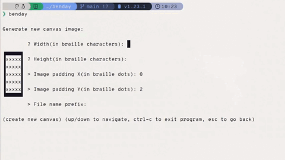
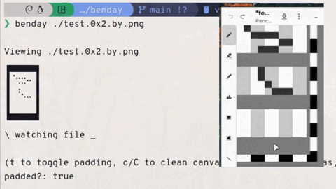
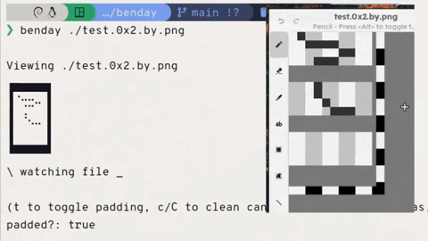
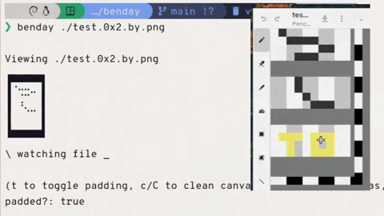
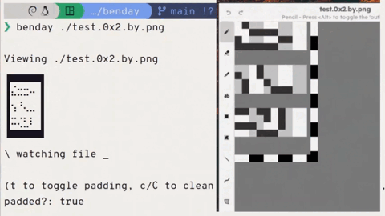
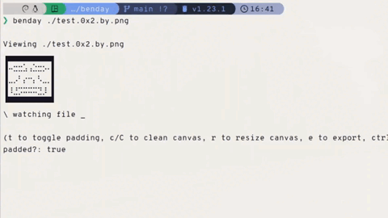
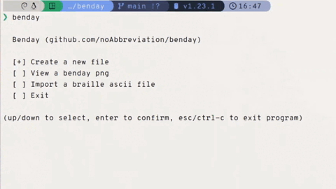

# Benday


Workflow CLI for editing braille ASCII art.
You can edit an image on your editor of choice, and it will show to the terminal on what it will look like.

## Features

#### Creating benday files



> [!NOTE]
> Benday files ends with `.by.png`

#### Near real time feedback when saving the canvas


#### Ignores non black colored pixels for comments



---

### Commands for ease of use



Pressing c will clean the canvas (not the comment pixels)

---



Pressing **<u>C</u>** will clean the canvas (including the comment pixels)

---


Pressing t will toggle the canvas' padding. You can move stuff more freely now.

---



Pressing r will bring up the resize interface where you can resize the canvas.

---

#### Export/import of braille ascii art





## Installation

If you have at least Go 1.23, install using the following command:

```
go install github.com/noAbbreviation/benday
```

> [!NOTE]
> A release may be in the works.

## Future stuff (maybe)

- Resizable and movable canvas viewport for bigger canvases
- OS native file locking
